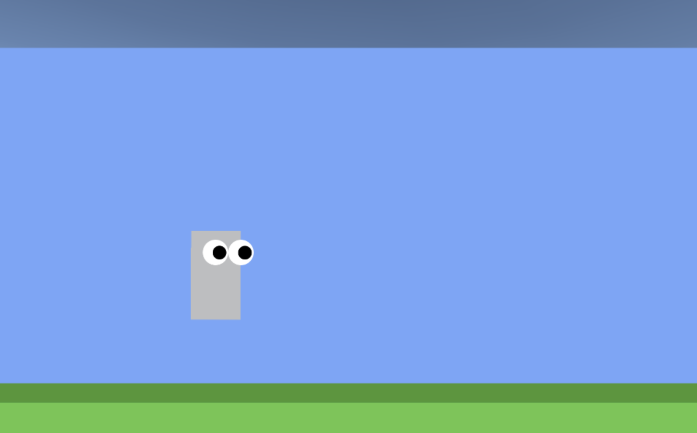

# My First Unity Project: Bouncing Pet Square




## About

**Bouncing Pet Square** is a simple yet fun game where you control a bouncing square as your pet. The goal is to keep it bouncing within its environment. This is my first game created using Unity and C#, and it demonstrates basic game mechanics such as physics and simple controls.

- **Main Features:**
  - Simple and easy to play
  - Control a bouncing square pet
  - Physics-based movement

## Play the Game

You can play the game directly on your browser by clicking the following link:

[**Play Bouncing Pet Square**](https://gatorrante.github.io/S6_FirstUnityProject/)

## Installation

1. **Clone the Repository:**
   - To clone the repository, run the following command in your terminal:
     ```bash
     git clone https://github.com/Gatorrante/S6_FirstUnityProject.git
     ```

2. **Checkout the Web Build:**
   - Switch to the `web_build` branch to access the build that can be run in a web browser:
     ```bash
     git checkout web_build
     ```

3. **Open in Unity:**
   - Open the project in Unity (version 2021.3 or later recommended).
   - Load the scene `MainScene` to start playing and testing the game.

4. **Run the Game:**
   - Press `Play` in the Unity Editor to test the game within the editor.
   - Alternatively, build the game for your desired platform by selecting `File > Build Settings...`.

## Screenshots

- **Main Gameplay Screen:**
  

## Development

This game was developed as a learning project to get familiar with Unity and C#. It demonstrates basic game development principles such as object movement, collision detection, and game physics.

## Links

- [Clone Repository](https://github.com/Gatorrante/S6_FirstUnityProject)
- [Play Bouncing Pet Square](https://gatorrante.github.io/S6_FirstUnityProject/)

<details>
  <summary>Leer en Español</summary>

  # Mi Primer Proyecto en Unity: Cuadrado Mascota Rebotador

  
  
  

  

  ## Acerca de

  **Cuadrado Mascota Rebotador** es un juego simple pero divertido donde controlas un cuadrado rebotador como tu mascota. El objetivo es mantenerlo rebotando dentro de su entorno. Este es mi primer juego creado usando Unity y C#, y demuestra mecánicas de juego básicas como física y controles simples.

  - **Características Principales:**
    - Simple y fácil de jugar
    - Controla una mascota cuadrada rebotadora
    - Movimiento basado en física

  ## Jugar al Juego

  Puedes jugar al juego directamente en tu navegador haciendo clic en el siguiente enlace:

  [**Jugar a Cuadrado Mascota Rebotador**](https://gatorrante.github.io/S6_FirstUnityProject/)

  ## Instalación

  1. **Clonar el Repositorio:**
     - Para clonar el repositorio, ejecuta el siguiente comando en tu terminal:
       ```bash
       git clone https://github.com/Gatorrante/S6_FirstUnityProject.git
       ```

  2. **Cambiar a la Build Web:**
     - Cambia a la rama `web_build` para acceder a la build que puede ejecutarse en un navegador web:
       ```bash
       git checkout web_build
       ```

  3. **Abrir en Unity:**
     - Abre el proyecto en Unity (se recomienda la versión 2021.3 o posterior).
     - Carga la escena `MainScene` para comenzar a jugar y probar el juego.

  4. **Ejecutar el Juego:**
     - Presiona `Play` en el Editor de Unity para probar el juego dentro del editor.
     - Alternativamente, construye el juego para la plataforma que desees seleccionando `Archivo > Configuración de la Build...`.

  ## Capturas de Pantalla

  - **Pantalla Principal del Juego:**
    

  ## Desarrollo

  Este juego fue desarrollado como un proyecto de aprendizaje para familiarizarme con Unity y C#. Demuestra principios básicos de desarrollo de juegos como el movimiento de objetos, detección de colisiones y la física del juego.

  ## Enlaces

  - [Clonar Repositorio](https://github.com/Gatorrante/S6_FirstUnityProject)
  - [Jugar a Cuadrado Mascota Rebotador](https://gatorrante.github.io/S6_FirstUnityProject/)
</details>
